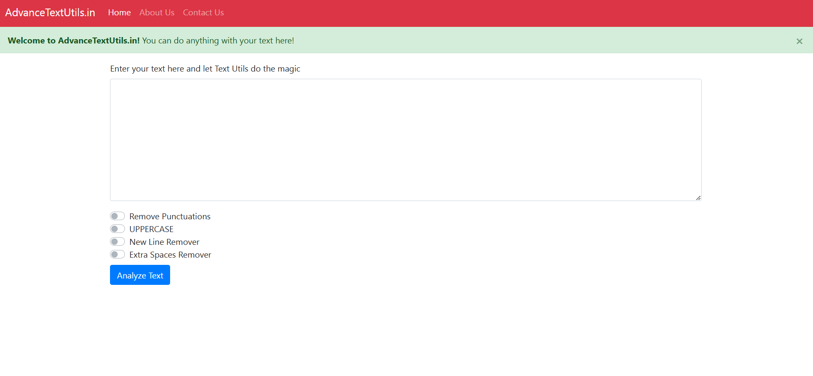
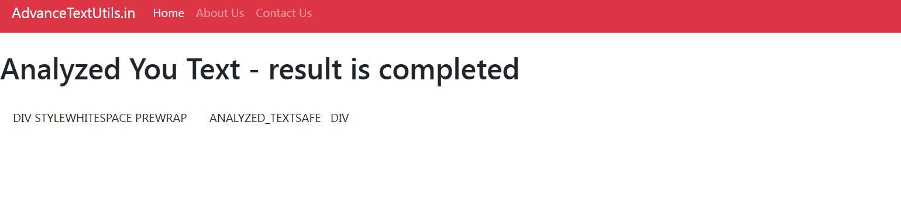

# AdvanceTextUtils - A Django Web Application

## Project Overview
AdvanceTextUtils is a Django-based web application that provides a suite of text manipulation tools. Key features include:
- Converting lowercase text to uppercase.
- Counting the number of characters in a text.
- Removing extra spaces from text.
- Additional text processing utilities.

## Photo Upload Feature
In addition to text utilities, the project supports uploading two photos. Users can leverage Django’s built-in file handling to upload and process images.
## Photo Demonstration




## Setup Instructions
1. Ensure you have Python and Django installed.
2. Clone the project repository.
3. Install the required packages using:
    ```bash
    pip install -r requirements.txt
    ```
4. Configure your Django settings.
5. Run migrations:
    ```bash
    python manage.py migrate
    ```
6. Start the development server:
    ```bash
    python manage.py runserver
    ```

## Usage
- Visit the home page to access text utility functions.
- Navigate to the photo upload section to select and upload two images.

## Notes
For detailed implementation and usage instructions, please refer to the project documentation and the Django app structure.

Happy Coding!
